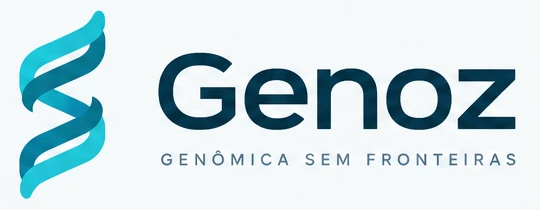
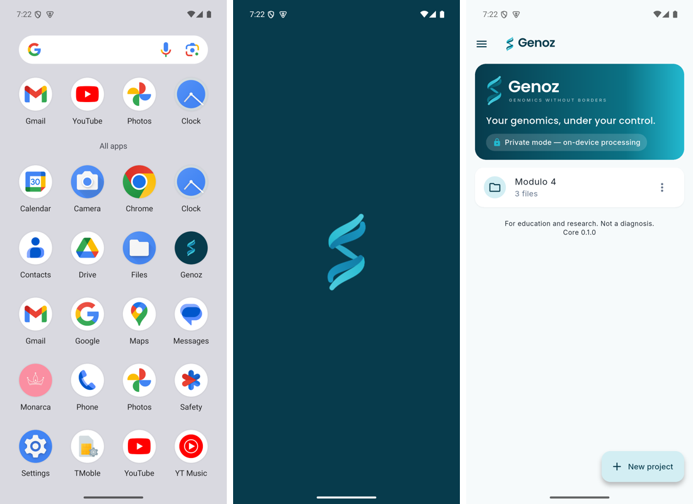

# Genoz — Guia de estilo

Fonte: `guia_de_estilo_original.png` (fornecido em 30/09/2026). Recortes de referência em [`recortes/`](recortes/).

- Nome: **Genoz**
- Assinatura: **GENÔMICA SEM FRONTEIRAS**
- Slogan: **Sua genômica, no seu controle.**
- Tela de abertura: **Análise genômica local e privada**

## Paleta principal

| Token | Hex | Uso |
|---|---|---|
| `petroleum` (Azul-petróleo / Genoz Médio) | `#0B7285` | cor primária, botões, ícones |
| `deep` (Azul profundo / Genoz Escuro) | `#073B4C` | logo, fundos escuros, menu lateral, tela de abertura |
| `cyan` (Ciano / Genoz Claro) | `#22B8CF` | destaques, links, barras de progresso |
| `background` (Fundo) | `#F6FAFB` | fundo geral (tema claro) |
| `surface` (Superfície) | `#FFFFFF` | cards e diálogos |

## Texto

| Token | Hex | Uso |
|---|---|---|
| `textPrimary` | `#17212B` | títulos e texto principal |
| `textSecondary` | `#64748B` | descrições e rótulos |

## Estados

| Token | Hex | Uso |
|---|---|---|
| `success` | `#2F9E44` | positivo / válido |
| `warning` | `#F59E0B` | atenção / avisos |
| `error` | `#D94841` | erro / inválido |
| `info` | `#6366F1` | informação |

## Gradientes

| Nome | De → Para | Uso |
|---|---|---|
| Principal | `#073B4C` → `#22B8CF` | cabeçalhos, tela de abertura, destaques de marca |
| Alternativo | `#4C1D95` → `#38BDF8` | feedback e ações especiais (usar com moderação) |

## Elementos

- **Símbolo:** dupla hélice estilizada em "S", em tons de ciano e petróleo.
- **Ícone do app:** símbolo sobre quadrado arredondado em azul profundo (`recortes/icone_do_app.png`).
- **Menu lateral:** fundo azul profundo, item ativo em azul-petróleo com cantos arredondados (`recortes/tela_menu_lateral.png`).
- **Cards:** superfície branca, cantos bem arredondados, sombra suave (`recortes/tela_resultados.png`).
- **Barras de frequência:** trilho claro + preenchimento ciano/petróleo.
- **Pilares da marca:** Ciência · Privacidade · Desempenho · Multiplataforma (`recortes/pilares_da_marca.png`).
- **Tipografia:** Poppins (geométrica) no logotipo e títulos; Inter no texto da interface; ambas embutidas no app (sem baixar da internet).

## Regras de uso no Genoz

1. **Contraste:** texto sobre ciano (`#22B8CF`) usa `deep` (`#073B4C`), nunca branco (o branco não atinge o contraste mínimo de acessibilidade).
2. **Cores de estado nunca são o único sinal:** sempre acompanhadas de ícone e texto (daltonismo).
3. **Tema escuro:** fundo derivado de `deep`; `cyan` vira a cor de destaque principal.
4. **Sem conotação clínica:** a referência `tela_resultados.png` mostra "Impacto Alto/Moderado/Baixo" em genes como BRCA1. No Genoz, rótulos desse tipo só aparecem **citando a fonte da anotação** (Módulo 10), nunca como classificação própria do app, conforme a especificação ("não é diagnóstico").

## Implementação no app (Módulo 5)

| Elemento | Onde |
|---|---|
| Símbolo em vetor (claro e escuro) | `app/assets/marca/simbolo.svg`, `simbolo_escuro.svg` — gerados por `tools/marca/gerar_marca.py` |
| Ícone e abertura | gerados a partir de `app/assets/marca/*.png` (ver ADR-011) |
| Tipografia | Poppins (títulos, logotipo) e Inter (texto), embutidas, licença OFL |
| Tokens de cor | `app/lib/ui/theme.dart` (`GenozColors`, `GenozPalette`) |
| Componentes | `app/lib/ui/brand.dart` (logo, cabeçalho com gradiente, menu lateral, estado vazio) |
| Contraste | verificado por `app/test/contrast_test.dart` (claro e escuro) |

Prévias: [`marca/previa_icone.png`](marca/previa_icone.png), [`marca/previa_simbolo_fundo_claro.png`](marca/previa_simbolo_fundo_claro.png).
Capturas no Android: [`capturas/`](capturas/).

